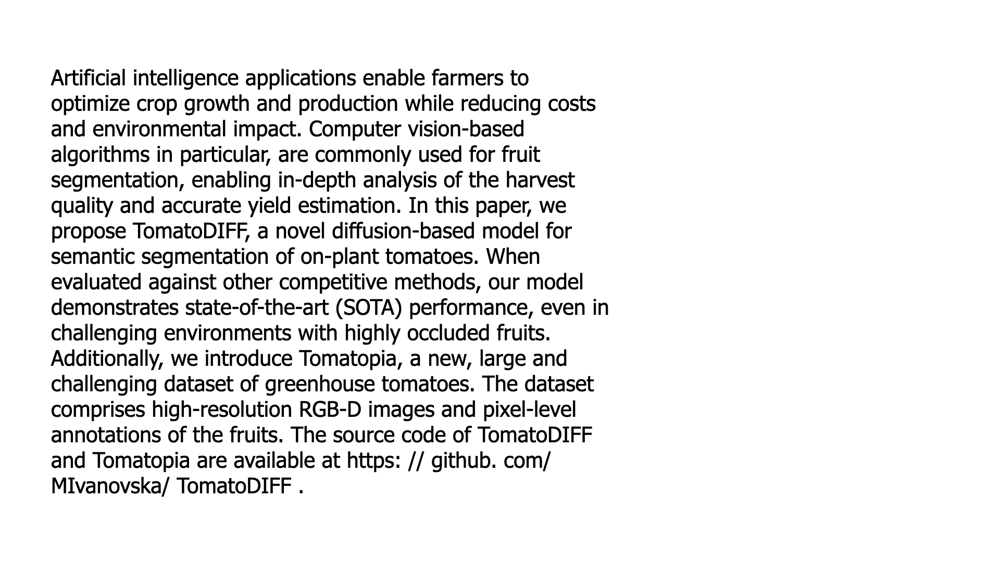

---
hide:
  - navigation
---

# Sentence Models

> A different take on textcat.

## Why sentence models? 

I was working on a project that tries to detect topics in academic articles found on arxiv. One of the topics I was interested in was "new datasets". If an article presents a new dataset there's usually something interesting happening so I wanted to build a classifier for it. 

<figure>
    

        
    

    <figcaption style="text-color: gray; margin-left: auto; margin-right: auto; text-align:center; "><small>I'm dealing with abstracts that look like this.</small></figcaption>
</figure>

You could build a classifier on the entire text and that could work, but it takes _a lot_ of effort to annotate because you'd need to read the entire abstract. It's probably hard for an algorithm too. It has to figure out what part of the abstract is important for the topic of interest and there's a lot of text that might matter. 

But what if we choose to approach the problem slightly differently?

<figure>
    

        
    

    <figcaption style="text-color: gray; margin-left: auto; margin-right: auto; text-align:center; "><small>It seems a lot simpler to just detect sentences within the abstract.</small></figcaption>
</figure>

Maybe it makes sense to split the text into sentences and run a classifier on each one of those. This might not be perfect for _every_ scenario out there. But it seems like a valid starting point to help you annotate and get started. 

If you have sentence level predictions, you could re-use that to do abstract-level predictions.

<figure>
    

        
    

    <figcaption style="text-color: gray; margin-left: auto; margin-right: auto; text-align:center; "><small>This is how you might use sentence-level predictions to classify abstracts.</small></figcaption>
</figure>

And the library is set up in such a way that you can add as many labels as you like. We're even able to do some clever fine-tuning tricks internally.

## Documentation 

Did this make you curious? Check out [the docs](https://koaning.github.io/sentence-models/) for a more in-depth quickstart! 

