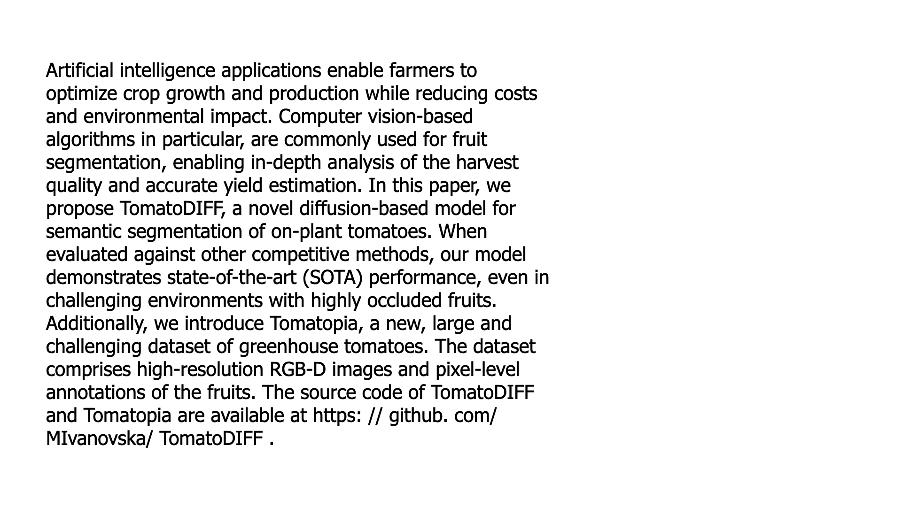
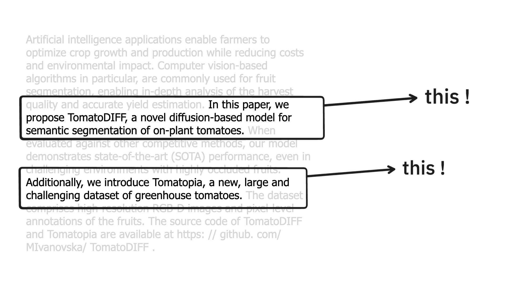
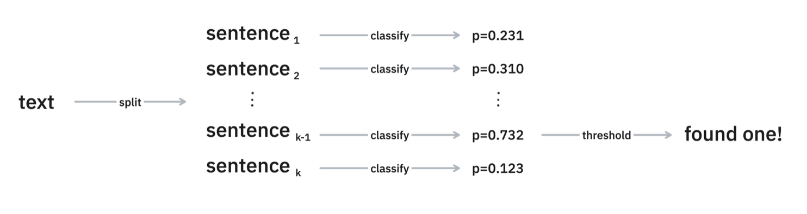
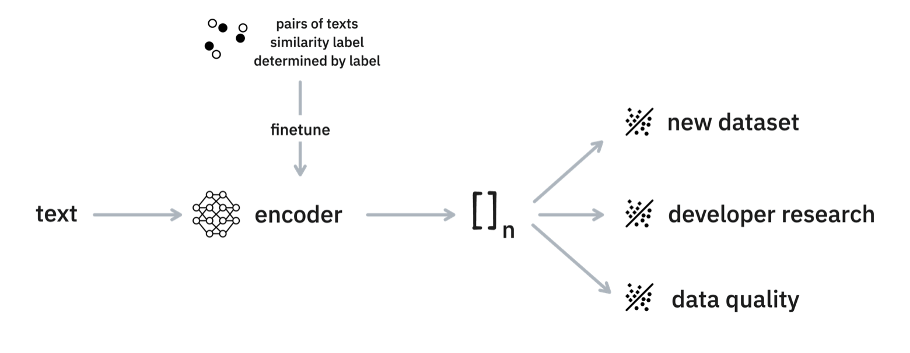

---
hide:
  - navigation
---


# Sentence Models

> A different take on textcat.

## Quickstart 

This project is all about making text classification models by predicting properties on a sentence level first. 

```python
from sentence_models import SentenceModel

# Learn a new sentence-model
smod = SentenceModel().learn_from_disk("annotations.jsonl")

# Make a prediction
example = "In this paper we introduce a new dataset for citrus fruit detection.
We also contribute a state of the art algorithm."

smod(example)
```

The output of this model will make a prediction for each sentence so that you may build downstream rules on top of it. Here's what the predictions might look like, depending on the labels in the `annotations.jsonl` file.

```python
{
    'text': 'In this paper we introduce a new dataset for citrus fruit detection. We also contribute a state of the art algorithm.',
    'sentences': [
        {
            'sentence': 'In this paper we introduce a new dataset for citrus fruit detection.',
            'cats': {
                "new-dataset": 0.8654,
                "llm": 0.212,
                "benchmark": 0.321
            }
        },{
            'sentence': 'We also contribute a state of the art algorithm.',
            'cats': {
                "new-dataset": 0.398,
                "llm": 0.431,
                "benchmark": 0.967
            }
        },
    ]
}
```

### Learning from data 

The `SentenceModel` can learn from a `.jsonl` file directly, but will assume a specific structure when it is learning. Internally it runs the following PyDantic model to ensure the data is in the right format. 

```python
class Example(BaseModel):
    text: str
    target: Dict[str, bool]
```

That means that an example like below would work: 

```json
{
    "text": "In this paper we introduce a new dataset for citrus fruit detection",
    "target": {
        "new-dataset": True,
        "llm": False,
        "benchmark": False
    }
}
```

> It is preferable have `text` keys that represent a single sentence. It's not _required_. But the library will assume sentences when it makes a prediction.

Note that you _don't need to have all labels available in each example_. That's a feature! Typically when you're annotating it's a lot simpler to just annotate one label at a time and it's perfectly fine if you have examples annotated that don't contain _all_ the labels that you are interested in.

## Why sentence models? 

I was working on a project that tries to detect topics in academic articles found on arxiv. One of the topics I was interested in was "new datasets". If an article presents a new dataset there's usually something interesting happening so I wanted to build a classifier for it. 

<figure>
    <div style="">
        
    </div>
    <figcaption style="text-color: gray; margin-left: auto; margin-right: auto; text-align:center; "><small>I'm dealing with abstracts that look like this.</small></figcaption>
</figure>

You could build a classifier on the entire text and that could work, but it takes _a lot_ of effort to annotate because you'd need to read the entire abstract. It's probably hard for an algorithm too. It has to figure out what part of the abstract is important for the topic of interest and there's a lot of text that might matter. 

But what if we choose to approach the problem slightly differently?

<figure>
    <div style="">
        
    </div>
    <figcaption style="text-color: gray; margin-left: auto; margin-right: auto; text-align:center; "><small>It seems a lot simpler to just detect sentences within the abstract.</small></figcaption>
</figure>

Maybe it makes sense to split the text into sentences and run a classifier on each one of those. This might not be perfect for _every_ scenario out there. But it seems like a valid starting point to help you annotate and get started. 

If you have sentence level predictions, you could re-use that to do abstract-level predictions.

<figure>
    <div style="">
        
    </div>
    <figcaption style="text-color: gray; margin-left: auto; margin-right: auto; text-align:center; "><small>This is how you might use sentence-level predictions to classify abstracts.</small></figcaption>
</figure>

And the library is set up in such a way that you can add as many labels as you like. We're even able to do some clever fine-tuning tricks internally.

<figure>
    <div style="">
        
    </div>
    <figcaption style="text-color: gray; margin-left: auto; margin-right: auto; text-align:center; "><small>The internal pipeline.</small></figcaption>
</figure>

This approach isn't state of the art, there's probably a whole bunch of things we can improve. But it does seem like a pragmatic, and understandable, starting point for a lot of text categorisation projects. 

## API